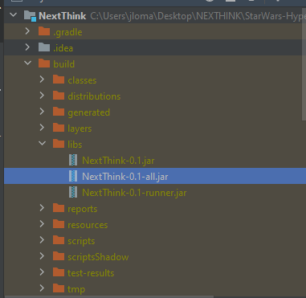

# Back-end Microservice

Here we got a backend microservice done in Java 11​, with Gradle :elephant: and Micronaut :telescope::milky_way: which allows the users to query and extract data from the star wars archives. 

As an extra feature is **dockerized**, check the section down below to know more about this.

## How many services and its purposes

In the mircoservice, we will only find just one service **NextThinkController** and one testing class **NextThinkTest**.
**NextThinkController**: It will create two **GET** endpoints, under the path and port: *localhost:3001/sw-search/*:

* character-name: Retrieves the spaceships that a character has used.
* planet-name: Retrieves the inhabitants of a given plane. 

Both endpoints return a json inside a string to be used. The endpoint uses the following app to obtain the data: https://swapi.dev/

**NextThinkTest**: It will create one test in which we will test the output of our microservice. The test consist in 4 request:

1. Request a character which exist. Luke
2. Request a character which doesn't exist in Star Wars: Jorge
3. Request a planet which exist in Star wars: Naboo
4. Request a planet which doesn't exist in Star wars: Earth.

## How to execute it?

To execute this bad-boy we will only need two easy commands. Before executing them please move under the folder *Back*.

Then, Like the Avengers said we will start with: ​​

```bash
./gradlew assemble
```

This command we will create a package called **Build**. Which will contain the data, executables, info and resource of our microservice. The result of the command should something like this:


Once this step is complete, in the following path (*BACK/NextThink/build/libs/*)  we should see the new items described above:



In concrete the item which most interest us is : **NextThink-0.1-all.jar**. This file is our executable and with the following command we will be able to execute it:

```bash
java -jar ./build/libs/NextThink-0.1-all.jar
```

That will create the following output:


With that our service will be up and running in the port 3001. 

### Notes

The terminal after launching the microservice will be render useless, unless you use commands like screen or put the task in the background. That's your choice.

## How can  I stop the service ?

Simply use the fantastic **Ctrl + C**.

## is It dockerized?

YES! This package is provided along with a Dockerfile which builds an image. To build it and execute it, use the following commands:

```bash
docker build -t NameOfTheImage . -f Dockerfile.microservice
```


Then with the following command we run it:

```bash
docker run -dp 3001:3001 starwars-hyperservice_microservice
```


If we want to stop it, it's as simple as checking the name of the container and stopping it

```bash
docker ps
docker stop ContainerID
```


## Future projects

### Wookiee support

The very first improvement of this project would be to give support to every one, and for that it's mandatory to include the format Wookie in this microservice. As simple as adding *&format=wookiee* we would improve the microservice and the data returned by him.
Try: *https://swapi.dev/api/planets/1/?format=wookiee*

### Improve unit test

Unit test can be improved a lot

### Add /info/ endpoint

Add more endpoints to display basic info of the api. It's true that the swagger is provided but sometimes is easier provide /info/ endpoints.