# Front-end Web-app

Here we got a front end web app done in ReactJS which allows the users to ask for star wars data. In concrete the spaceships that has belong to a character and the inhabitants of a planet. 

As an extra feature is **dockerized**, check the section down below to know more about this.

## Which components will found here?

You will find one component Material UI Table which generate two components. Each component has a different variable called columns which contains the headers that are displayed in the table.

This component is super smart and mimics the way of vuetify components. That will allow us to pass a json to the table without regarding <ttables>, or <tbody> or anything else. Just if like the table was a mere variable.

## How to execute it?

To execute this bad-boy we will only need two easy commands. Before executing them please move under the folder *FRONT/swa/*. It's required to have installed npm. Node.js (https://nodejs.org/en/)

We will start installing all the node modules required for this web-app to work: 

```bash
npm install
```

This command we will create a package called **node modules**. Which will allow us to execute the webapp: 
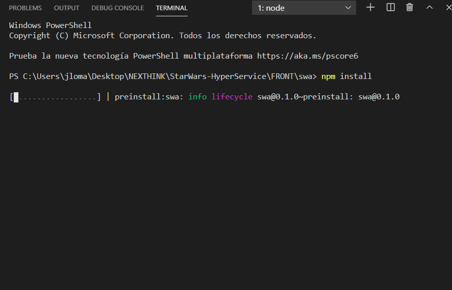

At the end you will find the following lines:
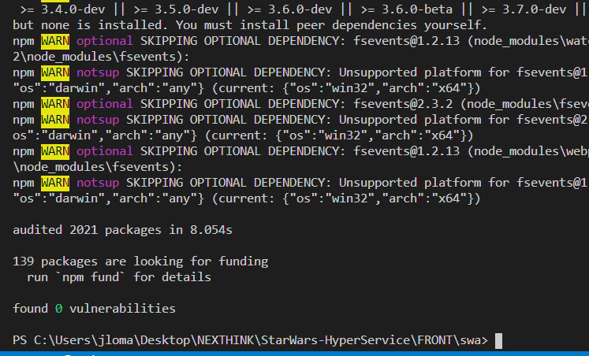

Once this step is done, we will be able to execute the webapp like this:

```bash
npm start
```

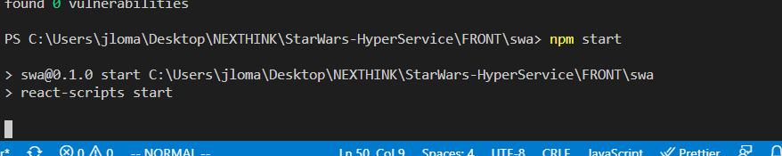

Finally we will see how the webapp is built and ready to be used:
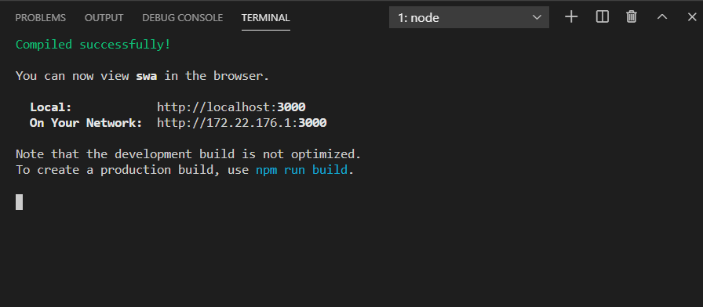

With that our service will be up and running in the port 3000. 

### Possible states 

These are the states that can be found in the web page: 

**Waiting for you to introduce something:**
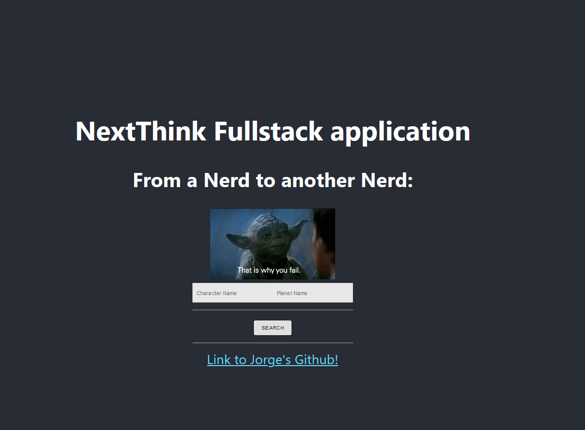

**Write the fields in blank:**
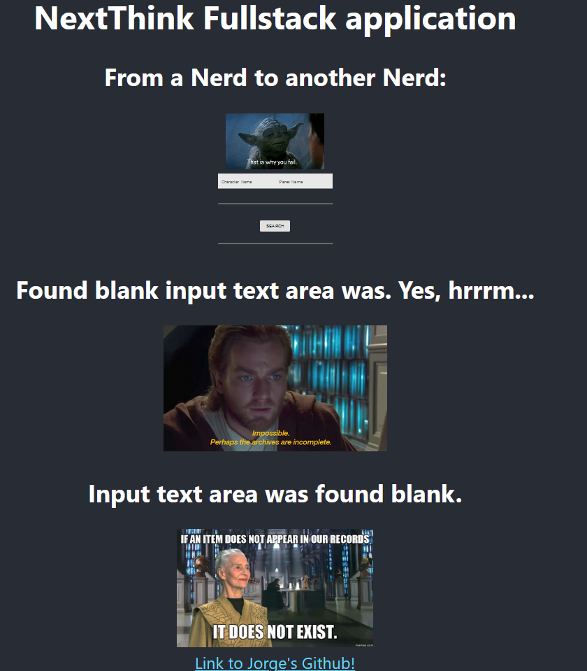

**Request a name:**	

* Success:

  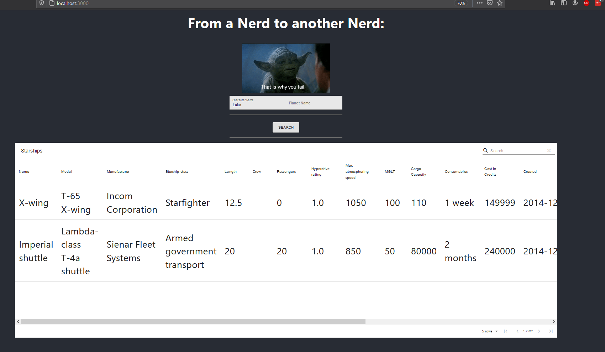

* Success but nothing to display:
  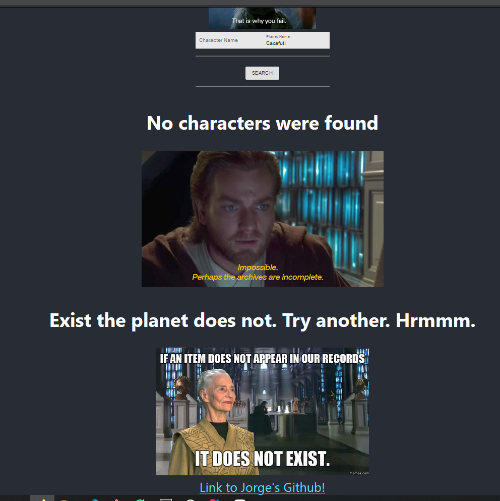

* Fail:
  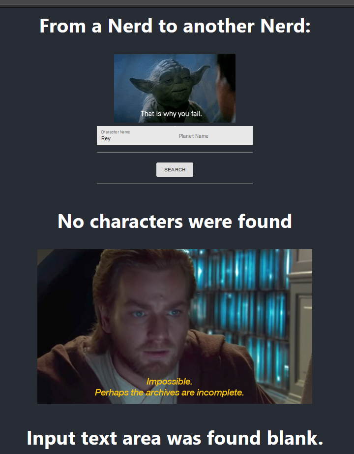

Request the inhabitants:	

* Success but nothing to display:
  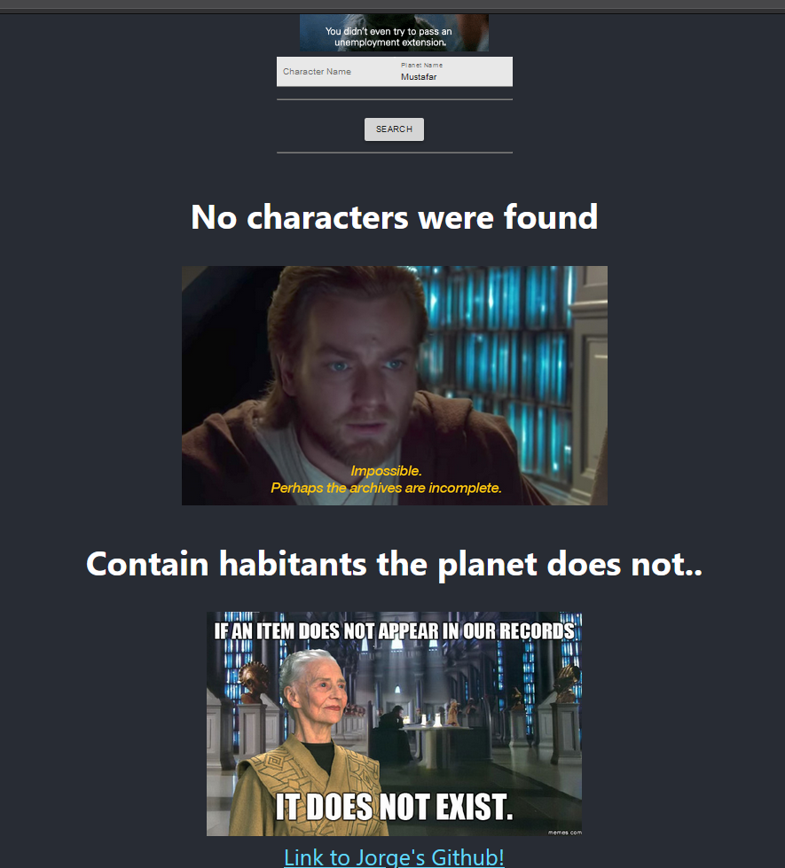

* Success:
  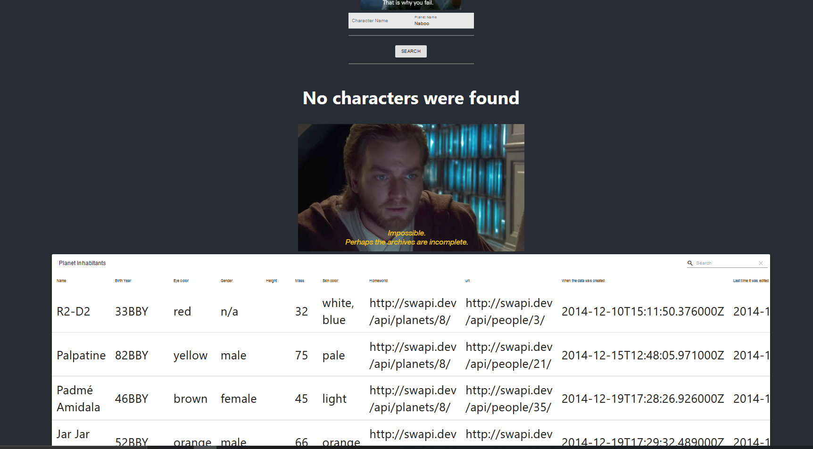

* Fail:
  

### Notes

The terminal after launching the webapp will be render useless, unless you use commands like screen or put the task in the background. That's your choice.

Besides you will an amazing link that will direct you to my Github :wink:
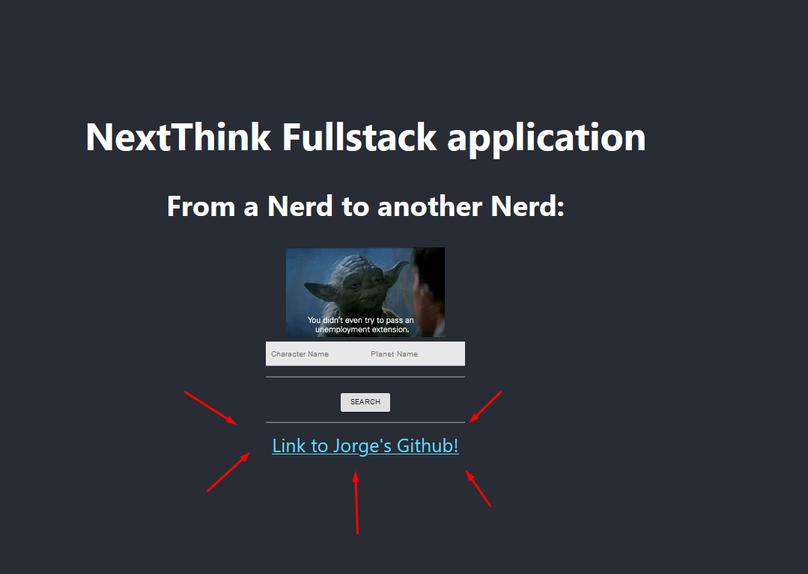
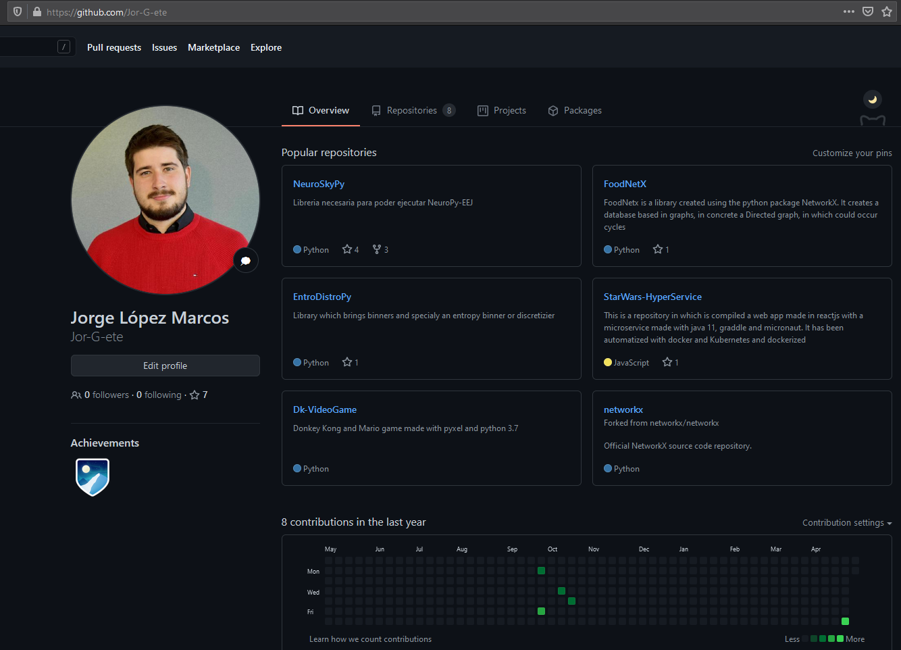

## How can  I stop the service ?

Simply use the fantastic **Ctrl + C**.

## is It dockerized?

YES! This package is provided along with a Dockerfile which builds an image. To build it and execute it, use the following commands:

```bash
docker build -t NameOfTheImage . -f Dockerfile.webapp
```

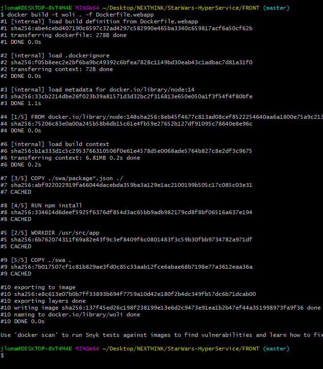

Then with the following command we run it:

```bash
docker run -dp 3000:3000 starwars-hyperservice_web-app
```

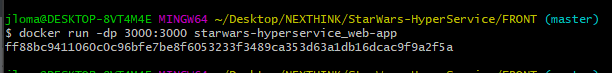

If we want to stop it, it's as simple as checking the name of the container and stopping it

```bash
docker ps
docker stop ContainerID
```

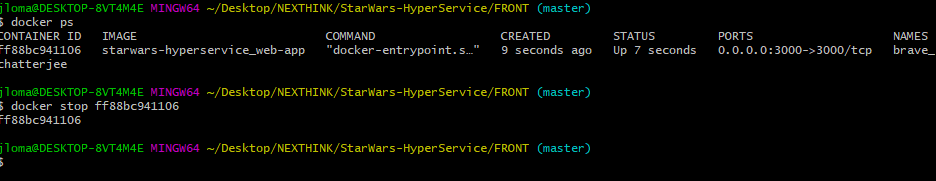

## Future projects

### Wookiee support

The very first improvement of this project would be to give support to every one, and for that it's mandatory to include the format Wookie in this webApp. As simple as adding a check box in the webpage. If checked it will add the following to the url : *&format=wookiee*.
Try: *https://swapi.dev/api/planets/1/?format=wookiee*

### Improve unit test

Unit test can be improved a lot

### Add more interactive components

### Move to VueJs and Vuetify. 

Check it out!