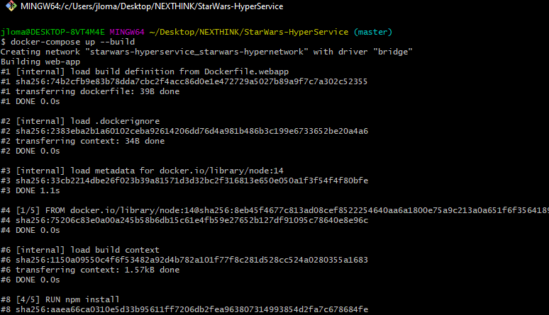
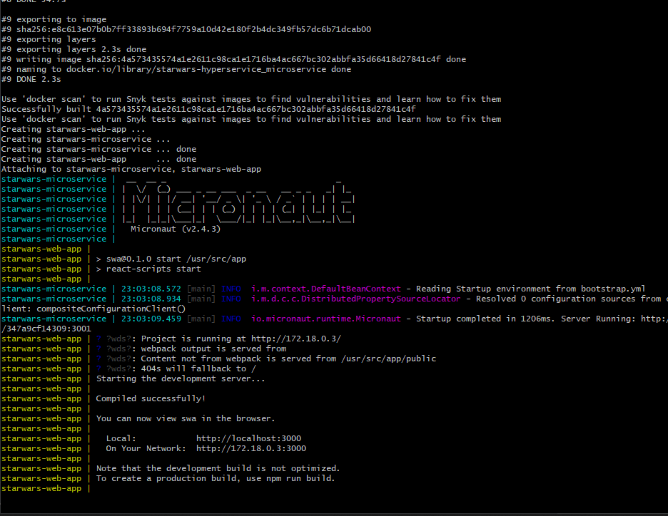
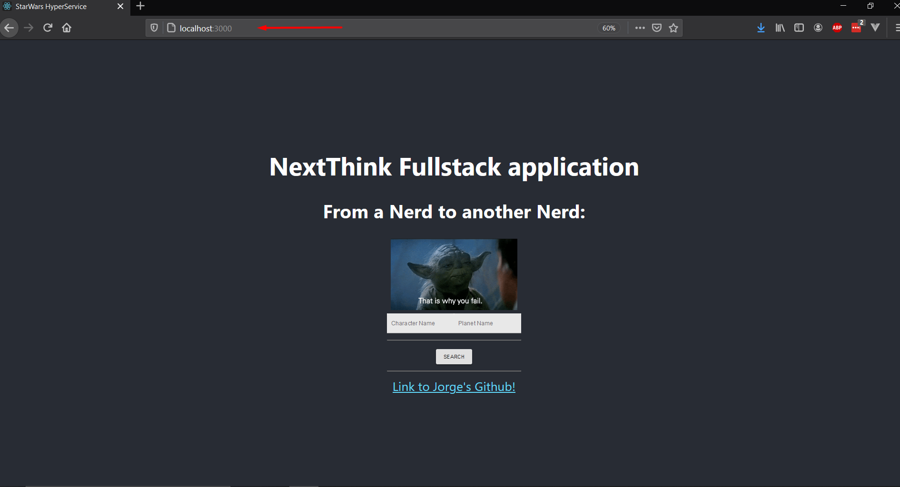
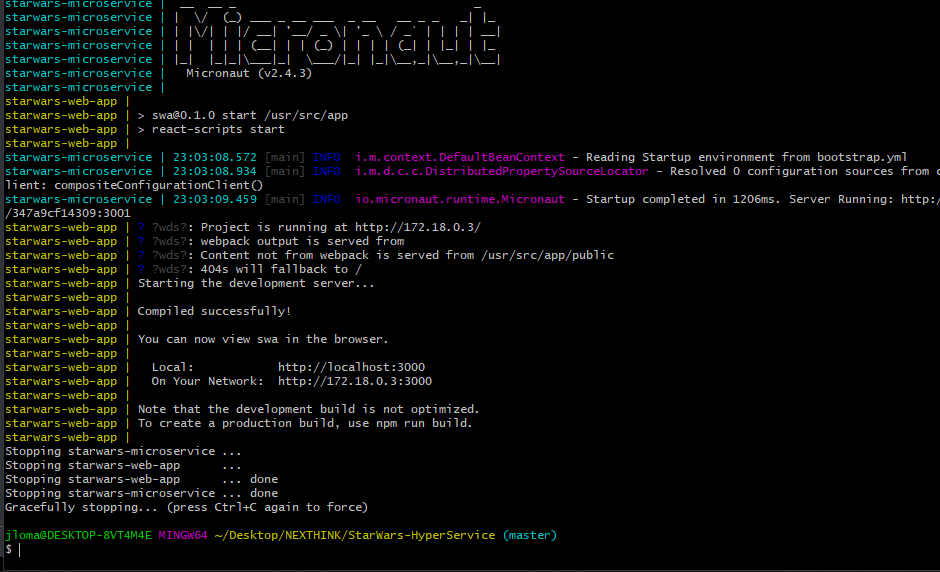
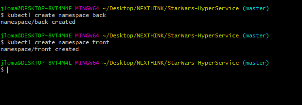
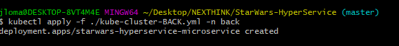
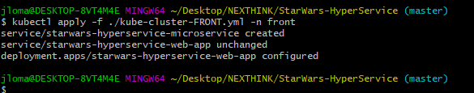
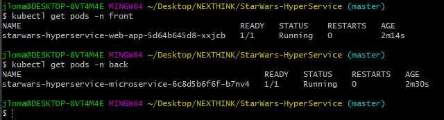
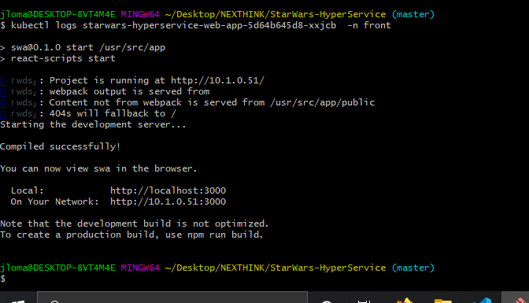

# StarWars HyperService

 

Due today is 4th of May ( btw, *May the force be with you*) I have created a web app which makes easier for all of us to search star wars data when we need to without going into the Jedi Archives.


It's a simple web app which uses the latest technology in microservices to request and expose data from Star Wars.
The technologies used are Java 11, Gradle, Micronaut, ReactJs, Node.Js and JavaScript.
It is divided in two main parts:

* FRONT - exposes a web app.
* BACK   - expose a microservice in Java.

In order to make it more reliable , scalable and easier to use it's dockerized and automatized to be found in docker hub, gitlab and github:

* In gitlab we will find the CI/CD, along with the Unit tests: https://gitlab.com/Jor-G-ete/StarWars-HyperService.
* In docker hub we will find the builds and the images of the dockers: https://hub.docker.com/repository/docker/frankieem/starwars-hyperservice
  In gitlab we will find the main project, packages, releases and source code: https://github.com/Jor-G-ete/StarWars-HyperService .

**Everyone is invited to contribute!**

## How to run it ? 

With one single command we will be able to build the images and run the containers in docker:

```bash
docker-compose up --build
```

The expected output will be: 






## Now that it's running what I can do with it?


Just open you favorite browser and type: 

```l
localhost:3000
```

And check how this bad boy is displayed!



Now it's the fun part, play as much as you want :wink: :heart:


## How do I stop it?


Easy peachy: Just use **Ctrl + C** . Here it's an image of the expected output:



## Do you want more info?


No prob! Inside each folder ( **FRONT** and **BACK** ) you will find a Readme explaining in deep how the services work in stand-alone and how can be invoked separately

## Can I move it to Kubernetes?

Of course! In the folder ***KUBE*** there are two files (*kube-cluster-FRONT.yml* and *kube-cluster-BACK.yml*) which allows you to run this whole application in a Kubernetes cluster, for those who doesn't know who to do it, these are the steps to follow:

1. Have Kubernetes activated in your docker desktop.

2. Create the namespaces back and front: 

   ```bash
   kubectl create namespace front && kubctl namespace back
   ```

   

3. Then create the pods:

   ```bash
   kubectl apply -f ./KUBE/kube-cluster-BACK.yml -n back
   kubectl apply -f ./KUBE/kube-cluster-FRONT.yml -n front
   ```

   

   

4. When they are created, we can check if they are ready and their names with the following command:

   ```bash
   kubectl get pods -n front
   kubectl get pods -n back
   ```



5. Finally we can check the logs of the pods with the following command:

   ```bash
   kubectl logs BackEndPodName -n back
   kubectl logs FrontEndPodName -n front
   ```

   

   It's deployed and running!! YAAAAAS!!! :happy:

   

## Things which can be improved

#### Unit test

By now only the microservice contains Unit test. This unit test can be improved a lot for now it consist in 4 assertions but could be more and more complex.
In case of the Web app, I personally believe it's unnecessary to create unit test to a component which receives data and displays it. In other words it doesn't return nothing.  In case a bigger complexity is developed in this component it will be necessary to create unit test. 
Also in the web app would be a good idea to create a unit test for the Api.js, due to it's the principal file which make request to the microservice. 

#### Wookiee support

The very first improvement of this project would be to give support to every one in the star wars universe, and for that it's mandatory to include the format Wookie in app. As simple as adding *&format=wookiee* in the query we would improve the data returned.
Try: *https://swapi.dev/api/planets/1/?format=wookiee*

#### Add and /info/ endpoint for each of the paths

#### Show the Swagger in the webapp


# Thanks for reading!


